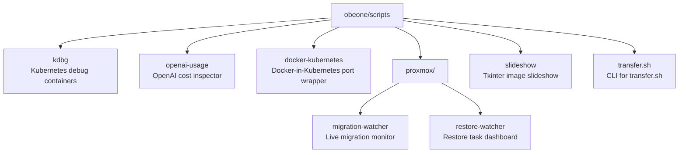

# scripts

A monorepo of self-contained Python and shell utilities for Kubernetes debugging, cloud cost inspection, virtualization monitoring, and more.

---



---

## Projects

| Icon | Project | Lang | Description |
|------|---------|------|-------------|
| 🐛 | [**kdbg**](kdbg/README.md) | Python 3.8+ | Interactive CLI to launch privileged debug containers against Kubernetes pods. Wraps `kubectl debug` with fzf selection and PSA management. PyPI: `kdbg` |
| 📊 | [**openai-usage**](openai-usage/README.md) | Python 3.10+ | Inspect OpenAI API token usage and costs per project/model/key. Color-coded terminal table with live pricing from litellm. PyPI: `openai-usage-report`. Docker available. |
| 🐳 | [**docker-kubernetes**](docker-kubernetes/README.md) | Bash | Wrapper for `docker` that auto-exposes ports on a Kubernetes service when running Docker-in-Kubernetes (DinD). |
| 📡 | [**proxmox/migration-watcher**](proxmox/migration-watcher/README.md) | Python 3.7+ | Monitor Proxmox QEMU live migrations with a real-time text-based speed graph. |
| 🔄 | [**proxmox/restore-watcher**](proxmox/restore-watcher/README.md) | Python 3.8+ | Monitor Proxmox restore tasks with a tqdm-style progress dashboard. |
| 🖼️ | [**slideshow**](slideshow/README.md) | Python 3.9–3.11 | Tkinter image slideshow with GIF support, shuffle, and brightness control. |
| 🚀 | [**transfer.sh**](transfer.sh/README.md) | Bash | Feature-rich CLI for transfer.sh: upload, download, delete, encrypt, progress bars. |

---

## Installation

### Python tools — install directly from GitHub with uv (recommended)

No clone needed:

```bash
uv tool install 'https://github.com/obeone/scripts.git#subdirectory=<project>'
```

| Tool | Command |
|------|---------|
| kdbg | `uv tool install 'https://github.com/obeone/scripts.git#subdirectory=kdbg'` |
| openai-usage | `uv tool install 'https://github.com/obeone/scripts.git#subdirectory=openai-usage'` |
| pve-migration-watcher | `uv tool install 'https://github.com/obeone/scripts.git#subdirectory=proxmox/migration-watcher'` |
| pve-restore-watcher | `uv tool install 'https://github.com/obeone/scripts.git#subdirectory=proxmox/restore-watcher'` |
| slideshow | `uv tool install 'https://github.com/obeone/scripts.git#subdirectory=slideshow'` |

`pipx` works as a drop-in replacement if you prefer it.

### Shell scripts

For `docker-kubernetes` and `transfer.sh`, clone the repo and follow the instructions in each project's `README.md`.

---

## Development

```bash
git clone https://github.com/obeone/scripts.git
cd scripts/<project>
uv venv && source .venv/bin/activate
uv pip install -e .
```

Each sub-project is fully self-contained with its own `pyproject.toml` and dependencies.

---

## License

MIT — [Grégoire Compagnon (obeone)](https://github.com/obeone)
