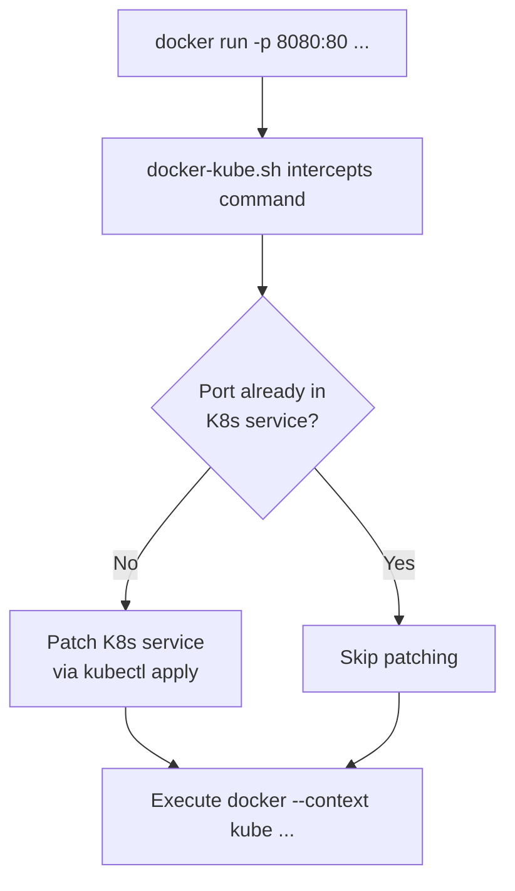

# docker-kube.sh

Bash wrapper for `docker` that automatically syncs published ports to a Kubernetes service when running Docker-in-Kubernetes (DinD).

---

## How it works



---

## Features

| Feature | Description |
|---|---|
| 🔌 Auto port exposure | Detects `-p`/`--publish` flags and patches the K8s service automatically |
| 📄 Compose support | Parses `compose.yaml` / `docker-compose.yml` with `yq` to extract all published ports |
| 🔁 Idempotent | Skips patching if port is already present on the service |
| ⚙️ Configurable | Service name, namespace, and protocol set via constants at the top of the script |
| 🪄 Drop-in replacement | Pass-through for all `docker` arguments — behaves transparently |

---

## Prerequisites

| Tool | Purpose |
|---|---|
| `docker` | Docker CLI |
| `kubectl` | Kubernetes CLI, configured to access your cluster |
| `jq` | JSON processor — used to patch the K8s service definition |
| `yq` | YAML processor — used to parse Docker Compose files |

---

## Installation

```bash
git clone https://github.com/obeone/scripts
cd scripts/docker-kubernetes
chmod +x docker-kube.sh
```

**Option A — Symlink (replaces `docker`):**

```bash
sudo ln -s "$(pwd)/docker-kube.sh" /usr/local/bin/docker
```

> Use with caution: this shadows the real `docker` binary. The script forwards all calls to the actual Docker CLI, but prefer option B if unsure.

**Option B — Alias:**

```bash
alias dkr="/path/to/docker-kube.sh"
```

---

## Configuration

Edit the constants at the top of `docker-kube.sh`:

| Variable | Default | Description |
|---|---|---|
| `K8S_SERVICE_NAME` | `"docker"` | Name of the K8s service to manage |
| `K8S_NAMESPACE` | `"docker"` | Namespace where the service lives |
| `K8S_DEFAULT_PROTOCOL` | `"TCP"` | Protocol assigned to newly added ports |

---

## Usage

```bash
./docker-kube.sh [docker arguments]
```

The script handles port management, then runs `docker --context kube [your arguments]`.

---

## Examples

### docker run

```bash
./docker-kube.sh run -d -p 8080:80 --name caddy caddy
```

1. Detects `-p 8080:80` → host port `8080`
2. Checks `docker` service in namespace `docker`
3. Adds port `8080` if missing
4. Runs `docker --context kube run -d -p 8080:80 --name caddy caddy`

### docker compose

**`compose.yaml`:**

```yaml
services:
  web:
    image: nginx
    ports:
      - "8081:80"
  api:
    image: my-api-image
    ports:
      - "9000:9000"
```

```bash
./docker-kube.sh compose up -d
```

1. Parses `compose.yaml` → host ports `8081`, `9000`
2. Ensures both ports are open on the K8s service
3. Runs `docker --context kube compose up -d`

---

## License

MIT — [obeone](https://github.com/obeone)
