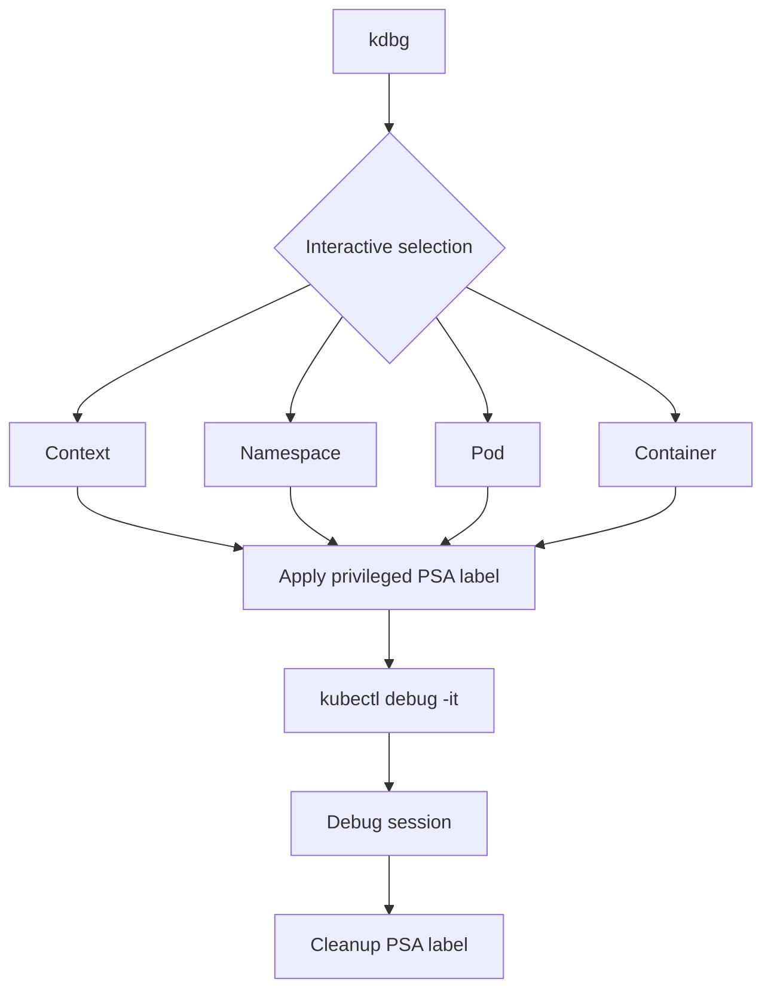

# kdbg


Interactive CLI to launch privileged debug containers against running
Kubernetes pods. Wraps `kubectl debug` with `fzf`-powered selection
and automatic Pod Security Admission management.



## 🚀 Features

| Feature | Description |
| --- | --- |
| 🔍 Interactive selection | `fzf`-powered picker for context, namespace, pod, and container |
| 🐳 Custom debug image | `--image` to use any debug image (default: `obeoneorg/netshoot`) |
| 🔒 PSA management | Auto-applies `privileged` label, cleans up on exit |
| 🧪 Dry-run mode | `--dry-run` prints the generated `kubectl` command |
| 🎨 Colored logging | Adjustable verbosity with `--log-level` |
| 🐚 Shell completion | Bash, Zsh, and Fish completion scripts |
| ⚙️ Security profiles | `--profile` or `KDBG_PROFILE` env var |

## 📋 Prerequisites

- **`kubectl`** — Kubernetes CLI, configured with cluster access
- **`fzf`** — command-line fuzzy finder

## 📦 Installation

### From PyPI (recommended)

```bash
uv tool install kdbg
```

or with pipx:

```bash
pipx install kdbg
```

### From GitHub

```bash
uv tool install \
  'kdbg @ git+https://github.com/obeone/scripts.git#subdirectory=kdbg'
```

### From a local clone

```bash
git clone https://github.com/obeone/scripts.git
uv tool install ./scripts/kdbg
```

### Shell completion

Add the appropriate line to your shell configuration file:

**Bash** (`~/.bashrc`):

```bash
eval "$(kdbg --completion bash)"
```

**Zsh** (`~/.zshrc`):

```zsh
eval "$(kdbg --completion zsh)"
```

**Fish** (`~/.config/fish/config.fish`):

```fish
kdbg --completion fish | source
```

## 🛠️ Usage

### Quick start

Run without arguments for full interactive mode:

```bash
kdbg
```

### Direct targeting

```bash
kdbg -C my-cluster -n my-namespace -p my-pod -c app-container
```

### Common options

| Option | Description |
| --- | --- |
| `-C`, `--context` | Kubernetes context |
| `-n`, `--namespace` | Target namespace |
| `-p`, `--pod` | Target pod |
| `-c`, `--container` | Target container |
| `-i`, `--image` | Debug image (default: `obeoneorg/netshoot`) |
| `--profile` | Security profile (default: `sysadmin`) |
| `--dry-run` | Print command without executing |
| `-l`, `--log-level` | `debug`, `info`, `warn`, `error` |

### Examples

**Custom debug image:**

```bash
kdbg --image busybox:latest
```

**Dry-run to inspect the command:**

```bash
kdbg -n my-namespace -p my-pod --dry-run
```

**Run a command in the debug container:**

```bash
kdbg -n my-namespace -p my-pod -- tcpdump -i eth0
```

**Verbose output:**

```bash
kdbg --log-level debug
```

---

## 📄 License

MIT — see [LICENSE](../LICENSE) for details.

**Author:** [obeone](https://github.com/obeone)
