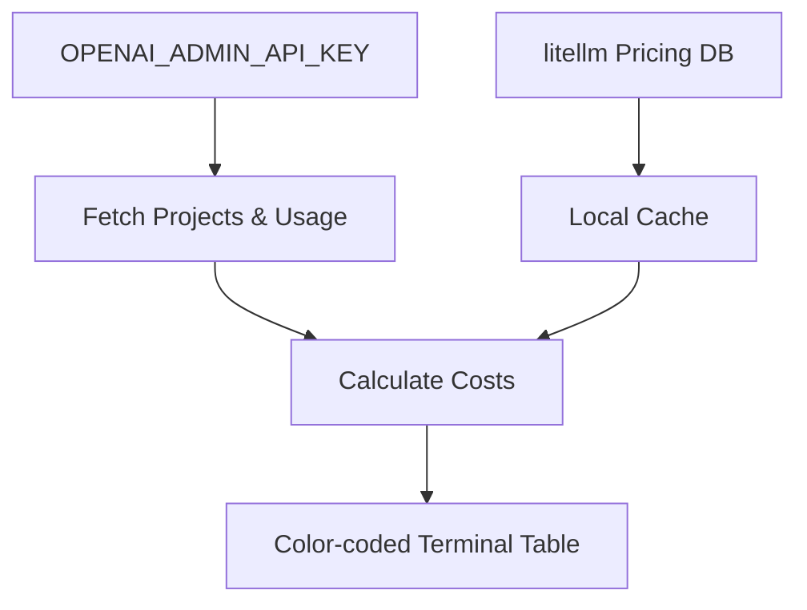

# openai-usage 📊


A command-line tool to inspect token usage and estimated cost for your OpenAI projects.



## 🚀 Features

| Feature | Description |
|---|---|
| 📋 **List Projects** | See all projects accessible with your admin API key |
| 📊 **Detailed Usage** | Usage data broken down by day, model, and API key |
| 💰 **Auto-Updated Pricing** | Pricing fetched from [litellm](https://github.com/BerriAI/litellm) and cached locally |
| 🔀 **Flexible Grouping** | Group and sort by day, project, key, or model |
| 📅 **Custom Date Ranges** | Focus on a specific time period |
| 🎨 **Colorful Output** | Clear, color-coded table for easy reading |

---

## 📦 Installation

### From PyPI (recommended)

```bash
pip install openai-usage-report
```

Or with `uv`:

```bash
uv pip install openai-usage-report
```

### From GitHub

```bash
# With uv
uv pip install git+https://github.com/obeone/scripts#subdirectory=openai-usage

# With pipx
git clone https://github.com/obeone/scripts
cd scripts
pipx install ./openai-usage
```

### Environment Variable

This tool requires an **admin-level** OpenAI API key:

```bash
export OPENAI_ADMIN_API_KEY="your_admin_api_key_here"
```

---

## 🔧 Usage

### List Available Projects

```bash
openai-usage --list-projects
```

### View Usage for All Projects

```bash
openai-usage
```

### View Usage for Specific Projects and a Date Range

```bash
openai-usage --projects proj_xxxxxxxxxxxx --start-date 2024-01-01 --end-date 2024-01-31
```

### Group and Sort Results

```bash
openai-usage --group-by project day
```

### Manage Pricing Data

Pricing is automatically fetched from litellm on first run and cached locally (`~/.cache/openai-usage/pricing.json`). To update manually:

```bash
openai-usage --update-pricing
```

To check cache status:

```bash
openai-usage --pricing-info
```

A warning is displayed if the cache is older than 30 days.

---

## 🐳 Docker Usage

| Command | Description |
|---|---|
| `docker build -t openai-usage .` | Build the image |
| `docker run --rm -e OPENAI_ADMIN_API_KEY="..." openai-usage` | View all projects usage |
| `docker run --rm -e OPENAI_ADMIN_API_KEY="..." openai-usage -l` | List projects |
| `docker run --rm -e OPENAI_ADMIN_API_KEY="..." openai-usage -p proj_xxx` | Specific project |

---

## ⚙️ Options

| Argument | Short | Description | Default |
|---|---|---|---|
| `--help` | `-h` | Show the help message and exit | |
| `--list-projects` | `-l` | List available projects and exit | |
| `--projects [ID ...]` | `-p` | One or more project IDs to analyze | All projects |
| `--start-date YYYY-MM-DD` | `-sd` | Start date for the usage report | Start of current month |
| `--end-date YYYY-MM-DD` | `-ed` | End date for the usage report | End of current month |
| `--group-by [CRITERIA ...]` | `-gb` | Criteria to group and sort results (order matters) | `day` |
| `--update-pricing` | | Fetch latest pricing from litellm and update local cache | |
| `--pricing-info` | | Show pricing cache path, last update date, and model count | |

**Available Grouping Criteria**: `day`, `project`, `key`, `model`

---

## 📄 License

MIT — Grégoire Compagnon ([@obeone](https://github.com/obeone))
