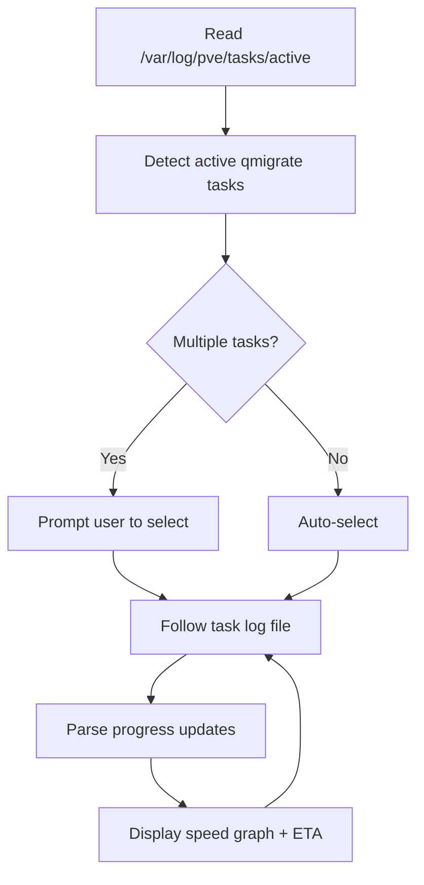

# pve-migration-watcher

Monitor Proxmox QEMU live migrations with a real-time transfer speed graph and ETA.



## Features

| Feature | Description |
| ------- | ----------- |
| Auto-detection | Finds all active QEMU migration tasks from Proxmox task logs |
| Task selection | Prompts when multiple migrations are running simultaneously |
| Progress display | Transferred / total (GiB), percentage complete |
| Speed graph | Real-time text-based transfer speed history via `plotext` |
| ETA | Estimated time to completion based on current speed |
| Log tail | Recent raw log lines shown below the graph |
| In-place updates | ANSI escape codes keep the display clean and non-scrolling |

## Installation

Requires Python 3.7+. Must be run on a Proxmox node (or with filesystem access to `/var/log/pve/tasks/`).

### Using uv (recommended)

```bash
uv tool install 'https://github.com/obeone/scripts.git#subdirectory=proxmox/migration-watcher'
```

### Using pipx

```bash
pipx install 'https://github.com/obeone/scripts.git#subdirectory=proxmox/migration-watcher'
```

### From a local clone

```bash
cd proxmox/migration-watcher
uv tool install .
# or: pipx install .
```

## Usage

```bash
pve-migration-watcher
```

The tool detects active migrations, lets you pick one if several are running, then streams live progress until the migration completes or you press `Ctrl+C`.

## Requirements

- Python 3.7+
- `plotext` (installed automatically)
- Read access to `/var/log/pve/tasks/` — run on a Proxmox node

## License

MIT
