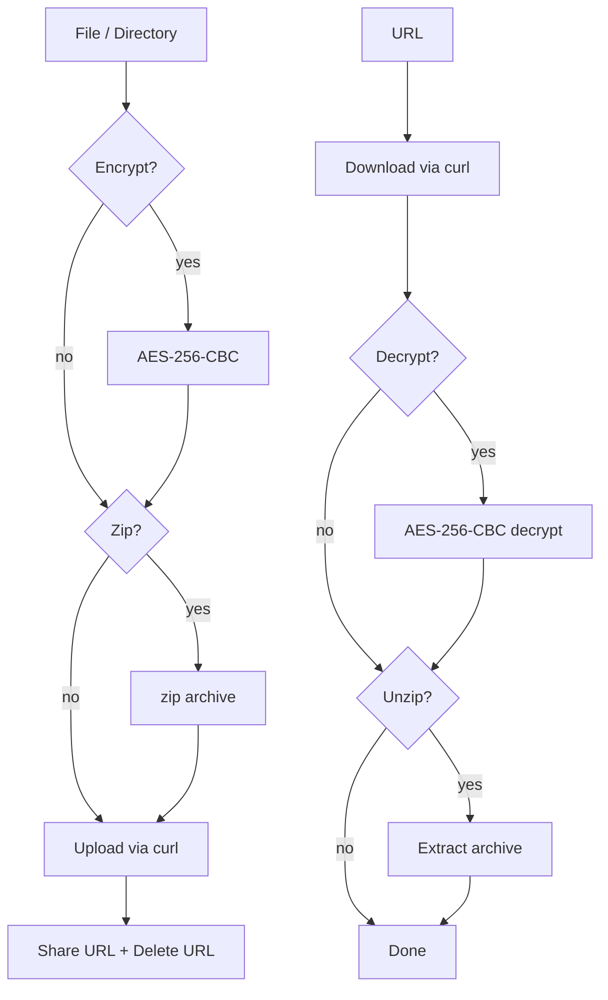

# transfer.sh CLI

Bash CLI for uploading, downloading, deleting and inspecting files on any [transfer.sh](https://transfer.sh) instance, with client-side AES-256-CBC encryption, auto-zip, and progress bars.

---



---

## Features

| | Feature | Detail |
|---|---|---|
| 📤 | **Send** | Upload files or directories; directories and multiple files are auto-zipped |
| 📥 | **Receive** | Download with optional decryption and auto-unzip prompt |
| 🗑️ | **Delete** | Remove a file using its delete URL |
| ℹ️ | **Info** | Retrieve file metadata (size, expiration, …) |
| 🔒 | **Encryption** | Client-side AES-256-CBC — server never sees plaintext |
| 📦 | **Auto-zip** | Multiple files or a directory → zipped transparently |
| ⏱️ | **Limits** | Per-upload max downloads and expiration days |
| 📊 | **Progress** | Upload/download progress bars via `pv` |
| 🌐 | **Custom instance** | Point to any transfer.sh-compatible server |
| 🔐 | **Basic auth** | Username/password for private instances |

**Prerequisites:** `curl`, `openssl`, `zip`, `pv`

---

## Installation

```bash
# Clone and make executable
git clone https://github.com/obeone/scripts.git
chmod +x scripts/transfer.sh/transfer.sh

# Or download the script directly
curl -o transfer.sh https://raw.githubusercontent.com/obeone/scripts/main/transfer.sh/transfer.sh
chmod +x transfer.sh

# (Optional) install system-wide
sudo mv transfer.sh /usr/local/bin/
```

---

## Usage

```bash
./transfer.sh [GLOBAL OPTIONS] <command> [COMMAND OPTIONS]
```

**Global options**

| Option | Description | Default |
|--------|-------------|---------|
| `--log-level <level>` | `ERROR` / `WARN` / `INFO` / `DEBUG` | `INFO` |
| `--tmp-dir <dir>` | Custom temporary directory | system `TMPDIR` |

---

### Commands

| Command | Description |
|---------|-------------|
| `send` | Upload one or more files / directories |
| `receive` | Download a file from a URL |
| `delete` | Delete a file using its delete URL |
| `info` | Show metadata for a shared file |

---

### `send`

```bash
./transfer.sh send [OPTIONS] <file|directory>...
```

| Option | Description |
|--------|-------------|
| `-d, --max-downloads <n>` | Maximum number of downloads |
| `-D, --max-days <n>` | Maximum days before expiration |
| `-k, --key <secret>` | Encrypt with AES-256-CBC using this key |
| `-u, --user <user>` | Basic auth username |
| `-p, --password <pass>` | Basic auth password |
| `-y` | Skip confirmation prompt |

```bash
# Upload a single file
./transfer.sh send ./myfile.txt

# Encrypt before upload
./transfer.sh send --key "mySuperSecretKey123" ./my-document.pdf

# Auto-zip a folder + a file
./transfer.sh send ./my_project_folder/ ./notes.txt

# 5-download limit, expires in 3 days
./transfer.sh send -d 5 -D 3 ./release.zip
```

---

### `receive`

```bash
./transfer.sh receive [OPTIONS] <URL> [destination]
```

| Option | Description |
|--------|-------------|
| `-k, --key <secret>` | Decryption key for an encrypted file |
| `-u, --unzip` | Prompt to extract archive after download |

```bash
# Download to current directory
./transfer.sh receive https://transfer.obeone.cloud/example/myfile.txt

# Download and decrypt
./transfer.sh receive --key "mySuperSecretKey123" https://transfer.obeone.cloud/example/myfile.txt.enc

# Download archive with unzip prompt
./transfer.sh receive -u https://transfer.obeone.cloud/example/archive.zip

# Download to a specific path
./transfer.sh receive https://transfer.obeone.cloud/example/image.jpg /home/user/images/
```

---

### `delete`

```bash
./transfer.sh delete <X-URL-Delete>
```

```bash
./transfer.sh delete https://transfer.obeone.cloud/example/myfile.txt/L2s3j...
```

The delete URL is printed by `send` after a successful upload.

---

### `info`

```bash
./transfer.sh info <URL>
```

```bash
./transfer.sh info https://transfer.obeone.cloud/example/myfile.txt
```

---

## Environment Variables

| Variable | Description | Default |
|----------|-------------|---------|
| `TRANSFERSH_URL` | Transfer.sh instance URL | `https://transfer.obeone.cloud` |
| `TRANSFERSH_MAX_DAYS` | Default expiration in days | — |
| `TRANSFERSH_MAX_DOWNLOADS` | Default download limit | — |
| `TRANSFERSH_ENCRYPTION_KEY` | Default encryption/decryption key | — |
| `AUTH_USER` | Basic auth username | — |
| `AUTH_PASS` | Basic auth password | — |
| `LOG_LEVEL` | Log level (`ERROR`/`WARN`/`INFO`/`DEBUG`) | `INFO` |
| `TMPDIR` | Temporary directory path | system default |

---

## License

MIT — [obeone](https://github.com/obeone)
